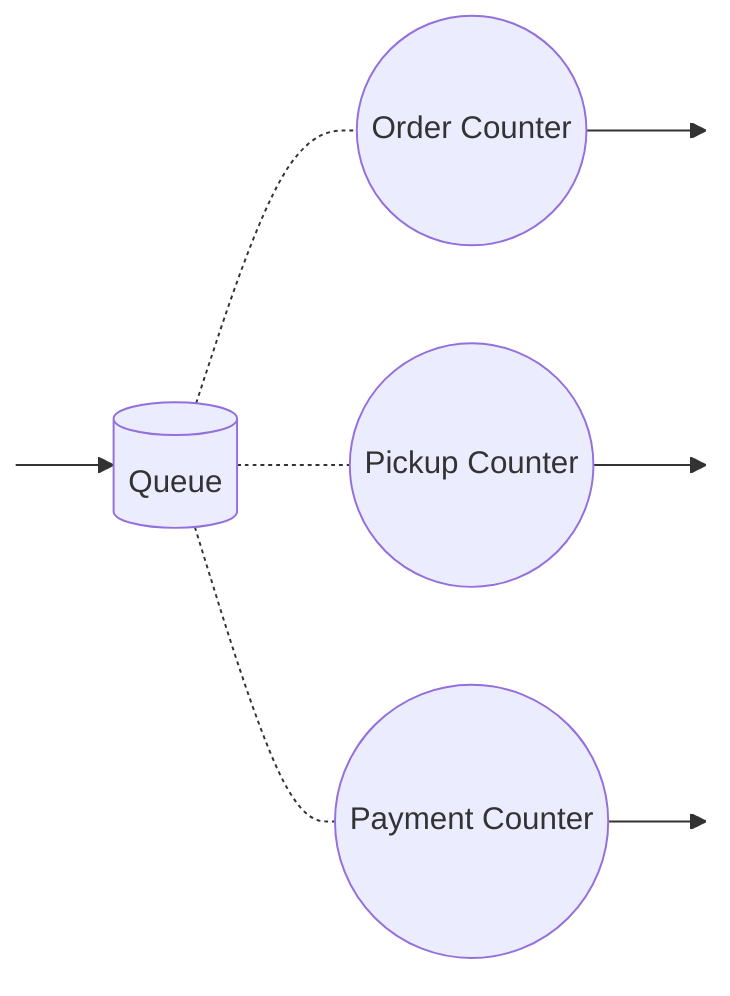
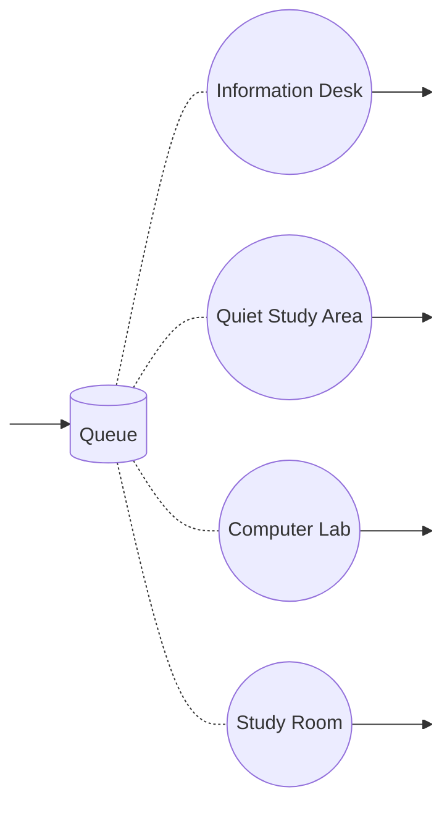

# Orientation Task 4 (Writing)

## 1.

**Question:** Using an example case (health centre, bank, etc.), discuss the meaning and characterisation of all the performance measures discussed in the lesson material using the concepts of the target system.

**Answer:**

Taking the example of a health centre, the performance measures are as follows:

1. **Patient Satisfaction**: Reflects the overall contentment of patients with provided healthcare services, encompassing communication, wait times, treatment outcomes, and overall experience, crucial for maintaining trust and loyalty.

2. **Wait Times**: Measure the efficiency of scheduling and resource allocation, directly impacting patient experience by indicating the speed and effectiveness of care delivery.

3. **Staff Productivit**y: Indicates the efficiency of healthcare professionals, assessing the number of patients attended to, diagnostic accuracy, and task completion speed, directly influencing patient outcomes.

4. **Resource Utilization**: Evaluates the effective use of medical equipment, facilities, and personnel, ensuring streamlined care delivery without unnecessary expenses or bottlenecks.

5. **Clinical Outcomes**: Reflects the success of treatments and interventions, measured by recovery rates, mortality rates, and disease management effectiveness, essential for assessing the quality of healthcare provided.

6. **Financial Performance**: Includes revenue, costs, profitability, and budget adherence, reflecting the health center's sustainability while ensuring quality care and future improvements.

7. **Compliance and Regulatory Measures**: Focuses on adherence to healthcare regulations and standards, ensuring patient confidentiality and overall compliance with industry norms and legal requirements for maintaining trust and legality.


## 2.

**Question:** Consider the categories in which performance measures are maintained/updated/computed. (Think in general terms: service point/customer; not in target system terms.)

**Answer:**

The categories in which performance measures are maintained/updated/computed are as follows:

1. **Operations**: Tracking efficiency, productivity, and resource use.

2. **Finance**: Assessing revenue, costs, profitability, and budget adherence.

3. **Customer**: Measuring satisfaction, feedback, and retention.

4. **Quality**: Ensuring adherence to standards and regulations.

5. **Strategy**: Evaluating progress toward long-term goals.

6. **Employees**: Monitoring satisfaction, turnover, and training effectiveness.


## 3.

**Question:** Design two different systems of three or four service points for a real-world destination. Use real-world concepts. Draw diagrams using the graphical representation of a service point shown in section ´Performance Variables´.

**Answer:**

1. **Supermarket System**




2. **Library System**




## 4.

**Question:** Write an algorithm in Java or pseudocode for the main loop of the simulator:

The main loop does all the things required for a three-phase simulation (presented in a section https://github.com/jacquesbergelius/PP-CourseMaterial/blob/master/1.2_Three_Phase_Simulation.md#three-phase-simulation).

Think in general terms (don't think in detail) and present a general solution. No need for target system concepts.

**Answer:**

```java
public class Simulation {
    // Define simulation parameters, state, and events

    public static void initializeSimulation() {
        // Initialize simulation parameters
        // Initialize initial state
        // Schedule initial events
    }

    public static void findTimeOfNextEvent() {
        // Determine the next event time based on A, B, and C events
        // Advance the simulation clock to the time of the next event
    }

    public static void executeBPhaseEvents() {
        // While there are B-phase events due at the current simulation time
            // Get the next B-phase event
            // Execute the event
            // Update the state based on the event
            // Possibly schedule new events based on the updated state
    }

    public static void attemptCPhaseEvents() {
        // While there are C-phase events that can be performed at the current simulation time
            // Get the next C-phase event
            // Attempt to execute the event
            // If the event was successfully executed
                // Update the state based on the event
                // Possibly schedule new events based on the updated state
    }

    public static boolean isSimulationComplete() {
        // Check conditions to determine if the simulation is complete
        // Return true if the simulation is finished, else false
        return /* simulation complete condition */;
    }

    public static void main(String[] args) {
        initializeSimulation();

        while (!isSimulationComplete()) {
            findTimeOfNextEvent();
            executeBPhaseEvents();
            attemptCPhaseEvents();
        }

        // Simulation completed
        System.out.println("Simulation completed.");
    }
}
```

## 5.

**Question:** Using the names of the simulator classes, explain the simulator a) what A-phase coding means b) what coding B-events means c) what coding C events means.

You can also write Java or pseudo code.

Present a general solution. No need for the target system concepts.

**Answer:**

```java
public class Simulator {
    // Define simulation parameters, state, and events

    // A-phase coding
    public void initialize() {
        // Initialize simulation parameters
        // Set initial state values
        // Schedule initial events
    }

    // B-events coding
    public void handleBEvents() {
        // While there are B-phase events due at the current simulation time
            // Get the next B-phase event
            // Execute the event
            // Update the state based on the event
            // Schedule new B-phase events based on current state        
    }

    // C-events coding
    public void handleCEvents() {
        // While there are C-phase events that can be performed at the current simulation time
            // Get the next C-phase event
            // Attempt to execute the event
            // If the event was successfully executed
                // Update the state based on the event
                // Schedule new C-phase events based on current state
    }

    public void runSimulation() {
        initialize();
        handleBEvents();
        handleCEvents();
    }
}
```

**Explanation:**

- A-phase coding refers to the initialization of the simulation state and initial events. It sets up the conditions for the beginning of the simulation.

- B-events coding refers to the execution of events or actions specific to the B-phase. It handles events triggered at certain simulation times or conditions.

- C-events coding refers to the execution of events specific to the C-phase. It handles events occurring towards the later stages of the simulation.
